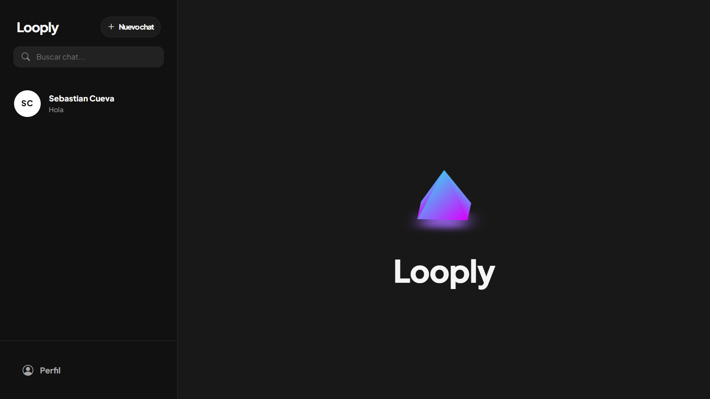

<div align="center">
  
  <h1>Looply</h1>
  <p><strong>Un moderno mini-chat en tiempo real construido con PHP</strong></p>
</div>

## 🚀 Sobre el Proyecto

Looply es una aplicación de chat moderna y responsiva que permite a los usuarios buscar contactos, iniciar nuevas conversaciones y chatear en tiempo real. Cuenta con una interfaz inspirada en diseños *glassmorphism* y se adapta perfectamente tanto a pantallas de escritorio como a teléfonos móviles.

## ✨ Características Principales

*   **Mensajería en Tiempo Real:** Chat instantáneo bidireccional gracias al uso de WebSockets.
*   **Diseño Responsivo:** Interfaz adaptativa que funciona como aplicación de escritorio y con un diseño especial para navegación desde el celular.
*   **Gestión de Perfil:** Posibilidad de editar tu nombre, usuario, correo electrónico y biografía directamente desde la aplicación.
*   **Selector de Emojis:** Menú integrado de emojis nativo que respeta el modo oscuro/claro de tu sistema.
*   **Directorio de Usuarios:** Búsqueda y listado de usuarios para iniciar nuevas conversaciones al instante.

## 🛠️ Tecnologías Utilizadas

### Backend
*   **[PHP](https://www.php.net/):** Lenguaje principal para la lógica del servidor, autenticación y procesamiento en base de datos.
*   **[MySQL](https://www.mysql.com/):** Base de datos relacional para gestionar usuarios, conexiones de conversaciones y el historial de mensajes.
*   **[Ratchet](http://socketo.me/):** Librería de PHP utilizada para la implementación del **servidor WebSocket**. Es la pieza clave que mantiene las conexiones vivas y distribuye los mensajes en tiempo real (instantáneamente) a la persona correcta sin que ninguna de las dos partes deba recargar la página.

### Frontend
*   **HTML5, CSS3 & JavaScript (Vanilla):** Estructura y dinamismo del cliente de manera ágil sin saturar la carga.
*   **[Bootstrap 5](https://getbootstrap.com/):** Framework de CSS utilizado como base, complementado con un potente archivo CSS personalizado (`custom.css`) para darle la estética transparente y atractiva (*premium look*).
*   **[emoji-picker-element](https://github.com/nolanlawson/emoji-picker-element):** Un *Web Component* super ligero utilizado para el selector de emojis en el chat. Al ser un componente nativo, es sumamente rápido, no afecta el rendimiento e incluye soporte automático para colores de modo oscuro.
*   **Bootstrap Icons:** Para toda la iconografía de la aplicación.

## ⚙️ Instalación y Configuración

1.  **Configurar la Base de Datos.**
    *   Importa tu esquema de base de datos MySQL.
    *   Configura las credenciales correctas en `config/database.php`.
2.  **Instalar dependencias.**
    *   Ejecuta `composer install` para instalar todas las dependencias necesarias de PHP (principalmente Ratchet).
3.  **Iniciar los servidores.**
    *   Para que la aplicación funcione correctamente, necesitas correr **dos** servidores simultáneos.
    *   **Servidor Web (PHP):** Sirve las páginas web normales.
        ```bash
        php -S localhost:8080
        ```
    *   **Servidor WebSocket:** Abre una *nueva terminal* en la raíz del proyecto y arranca el servidor encargado de la mensajería en tiempo real (trabaja en el puerto 8081).
        ```bash
        php bin/server.php
        ```

---
*Desarrollado como un sistema de chat en tiempo real en PHP.*
